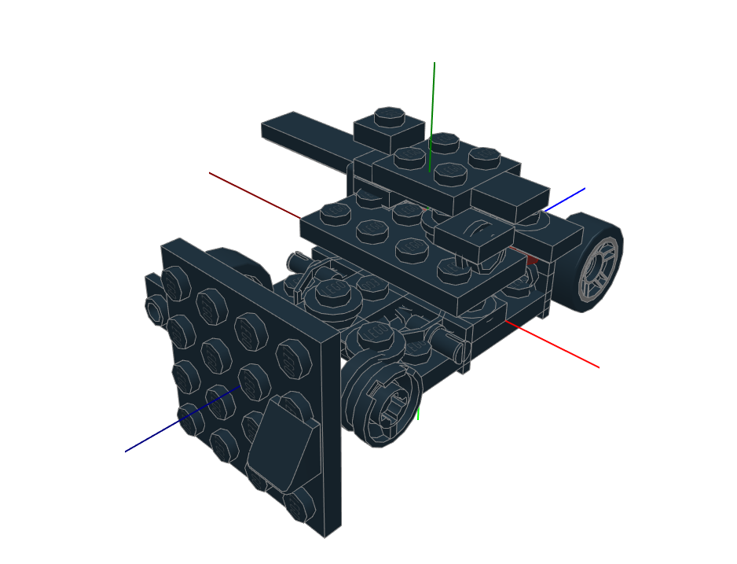

<!-- Ancre vers le haut -->

<br />
<div align="center">
  <a href="https://github.com/Alfred0404/atlas">
    
  </a>

  <h3 align="center">ATLAS</h3>

  <p align="center">
    Autoregressive Transformer Lego Assembly Synthesis
    <br />
    <a href="https://github.com/Alfred0404/atlas"><strong>Parcourir le repo »</strong></a>
  </p>
</div>

[![Contributors][contributors-shield]][contributors-url]
[![Forks][forks-shield]][forks-url]
[![Stargazers][stars-shield]][stars-url]
[![Issues][issues-shield]][issues-url]
[![LinkedIn][linkedin-shield]][linkedin-url]

## À propos du projet

ATLAS implémente un pipeline ML complet : parsing de fichiers LDraw `.mpd`, tokenisation de briques en séquences, entraînement d'un transformer decoder-only, et génération de nouveaux modèles LEGO. Chaque brique est encodée en une séquence fixe de 6 tokens `[part, x, y, z, rotation, couleur]`, et le modèle apprend à prédire la prochaine brique de manière autorégressif.

<p align="center">
    
    <br />
    <em>Exemple de génération du modèle ATLAS actuel</em>
</p>

## Getting Started

Prérequis

- Python 3.10+
- pip

Cloner le dépôt :

```bash
git clone https://github.com/Alfred0404/atlas.git
cd atlas
```

Installer les dépendances :

```bash
python -m venv venv
venv\Scripts\activate
pip install -r requirements.txt
```

Pour l'entraînement GPU (CUDA 12.4) :

```bash
pip install torch --index-url https://download.pytorch.org/whl/cu124
```

## Architecture

Le pipeline transforme des fichiers LDraw bruts en séquences tokenisées, puis entraîne un transformer decoder-only pour la génération autorégressif.

### Structure du Projet

```
ATLAS/
├── train_model.py              # Point d'entrée entraînement
├── generate_model.py           # Point d'entrée génération
├── atlas_config.json           # Vocabulaire et configuration spatiale
├── dataset/
│   ├── mpd_files/              # Fichiers .mpd / .ldr bruts
│   └── technic_blacklist.txt   # Sets Technic/Bionicle exclus
├── tokenized_sets/             # Séquences tokenisées (.npy)
├── checkpoints/                # Checkpoints du modèle
├── generated_sets/             # Sorties .mpd générées
├── src/
│   ├── config.py               # Constantes globales et chemins
│   ├── main.py                 # Point d'entrée traitement du dataset
│   ├── core/
│   │   ├── tokenizer.py        # Conversion brique $\rightarrow$ tokens
│   │   └── vocabulary.py       # Gestion du vocabulaire
│   ├── data/
│   │   ├── builder.py          # Pipeline de traitement end-to-end
│   │   ├── parser.py           # Parser MPD/LDraw et flattening
│   │   ├── adjacency.py        # Tri BFS par adjacence spatiale
│   │   ├── augmentation.py     # Augmentation (rotations, miroir, permutations)
│   │   └── sequence_dataset.py # Dataset PyTorch sur les .npy
│   ├── file_io/
│   │   ├── mpd_writer.py       # Export MPD
│   │   ├── scraper.py          # Téléchargement de datasets
│   │   └── omr_scraper.py      # Scraper OMR
│   ├── maths/
│   │   ├── rotations.py        # 24 rotations orthogonales discrètes
│   │   └── transforms.py       # Extraction positions/rotations
│   ├── model/
│   │   ├── config.py           # ModelConfig dataclass
│   │   ├── transformer.py      # ATLASTransformer (nn.Module)
│   │   ├── train.py            # Trainer (AdamW + cosine LR)
│   │   └── generate.py         # Génération par sampling
│   └── utils/
│       └── logging.py          # Configuration du logging
└── tests/
    ├── test_adjacency.py
    ├── test_augmentation.py
    ├── test_integration.py
    ├── test_rotations.py
    └── test_vocabulary.py
```

### Pipeline de données

1. **Parsing** : `MPDParser` lit les fichiers `.mpd` et aplatit les sous-modèles hiérarchiques en placements de briques world-space
2. **Tri par adjacence** : `sort_bricks_by_adjacency` ordonne les briques via BFS closest-first (KDTree + distance de Chebyshev normalisée)
3. **Centrage** : recentrage sur l'origine avec snapping sur grille (10 LDU en X/Z, 8 LDU en Y)
4. **Vocabulaire** : `VocabularyManager` gère les mappings parts/couleurs/rotations, persistés dans `atlas_config.json`
5. **Tokenisation** : chaque brique $\rightarrow$ 6 tokens `[part_id, x_bin, y_bin, z_bin, rotation, color]`
6. **Augmentation** : rotations globales 90°/180°/270°, miroir X, permutations BFS $\rightarrow$ 8× multiplicateur

**Ranges de tokens** :

- **Spéciaux** : `PAD=0, SOS=1, EOS=2, UNK=3` $\Rightarrow$ indices 0 $\rightarrow$ 3
- **Rotations** : 24 orientations orthogonales $\Rightarrow$ indices 4 $\rightarrow$ 27
- **Positions** : 1000 bins par axe (précision 2 LDU, range ±1000) $\Rightarrow$ indices 28 $\rightarrow$ 3027
- **Couleurs** : à partir de 3028
- **Parts** : offset dynamique après les couleurs

### Modèle

**ATLASTransformer** — ~7M paramètres, decoder-only :

- **Embeddings** : token + position absolue + champ intra-brique (7 champs : SOS + 6 par brique)
- **Architecture** : 6 couches, 8 têtes d'attention, 256-dim, 1024-dim FFN, pre-norm
- **Masquage** : attention causale + masquage de logits par champ (contraint les sorties aux ranges de tokens valides)

**Entraînement** : AdamW, linear warmup $\rightarrow$ cosine annealing, gradient clipping à 1.0, masquage de logits activé pendant le training.

**Génération** : sampling temperature + top-k avec masquage de logits par champ. Export `.mpd` via `mpd_writer.py`.

## Utilisation

- Flux de travail typique :
  1. Traiter le dataset : `python src/main.py`
  2. Entraîner le modèle : `python train_model.py`
  3. Générer un set : `python generate_model.py`

Les fichiers `.mpd` générés sont sauvegardés dans `generated_sets/` et peuvent être ouverts dans n'importe quel viewer LDraw (Studio, LDView, etc.).

## Entraînement

Le dataset contient ~1 600 sets LEGO officiels (après exclusion des sets Technic, Bionicle et Hero Factory via blacklist). Avec l'augmentation de données (rotations + miroir), le dataset effectif est de ~10 700 séquences.

Le pipeline de traitement utilise un système 2 passes :
1. **Pass 1** : parsing de tous les fichiers + construction du vocabulaire complet
2. **Pass 2** : tokenisation avec le vocabulaire figé (résultats du pass 1 cachés en mémoire)

### Résultats Actuels

#### ✅ Pipeline fonctionnel

Le pipeline complet fonctionne de bout en bout : parsing, tokenisation, entraînement et génération de fichiers `.mpd` valides.

#### ⚠️ Qualité de génération à améliorer

Les modèles générés ne sont pas encore réalistes — le modèle a tendance à répéter les mêmes positions.

**Causes probables identifiées :**

1. Modèle sous-entraîné
2. Pas de split train/val ni d'early stopping
3. Hyperparamètres à affiner (température, learning rate)

## Contribuer

Les contributions sont bienvenues : signalez des bugs via des issues et proposez des pull requests pour les améliorations.

## Licence

Distribué sous la licence du projet. Voir `LICENSE.txt` pour les détails.

<p align="center">
	<a href="https://github.com/Alfred0404/atlas/LICENSE"></a>
</p>

## Ressources

| Ressource | Description |
| :-------- | :---------- |
| [LDraw Parts Library](https://library.ldraw.org/parts/list) | Bibliothèque officielle des pièces LDraw |
| [LDraw File Format Spec](https://www.ldraw.org/article/547.html) | Spécification du format de fichier LDraw |
| [Seymouria Sets](https://www.seymouria.pl/Download/official-lego-sets-ldr.php) | Sets LEGO officiels au format LDR |
| [BrickGPT](https://avalovelace1.github.io/BrickGPT/) | Projet similaire de génération LEGO par transformer |
| [PointGPT](https://github.com/CGuangyan-BIT/PointGPT) | Transformer autoregressif pour nuages de points |

<p align="center">
	
</p>

<!-- LINKS & IMAGES -->
<!-- Contributors -->

[contributors-shield]: https://img.shields.io/github/contributors/Alfred0404/atlas.svg?style=for-the-badge
[contributors-url]: https://github.com/Alfred0404/atlas/graphs/contributors

<!-- Forks -->

[forks-shield]: https://img.shields.io/github/forks/Alfred0404/atlas.svg?style=for-the-badge
[forks-url]: https://github.com/Alfred0404/atlas/network/members

<!-- Stars -->

[stars-shield]: https://img.shields.io/github/stars/Alfred0404/atlas.svg?style=for-the-badge
[stars-url]: https://github.com/Alfred0404/atlas/stargazers

<!-- Issues -->

[issues-shield]: https://img.shields.io/github/issues/Alfred0404/atlas.svg?style=for-the-badge
[issues-url]: https://github.com/Alfred0404/atlas/issues

<!-- License -->

[license-shield]: https://img.shields.io/github/license/Alfred0404/atlas.svg?style=for-the-badge
[license-url]: https://github.com/Alfred0404/atlas/blob/master/LICENSE.txt

<!-- Linkedin -->

[linkedin-shield]: https://img.shields.io/badge/-LinkedIn-black.svg?style=for-the-badge&logo=linkedin&colorB=555
[linkedin-url]: https://linkedin.com/in/alfred-de-vulpian
