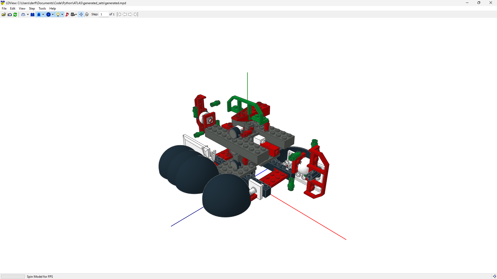

<div align="center">
  <a href="https://github.com/alfred0404/atlas">
    
  </a>

  <h1>ATLAS</h1>
  <p><em>Autoregressive Transformer Lego Assembly Synthesis</em></p>
</div>

## Overview

ATLAS is an autoregressive transformer that learns to generate LEGO models. The pipeline covers the full workflow: parsing raw LDraw files, tokenizing bricks into sequences, training a decoder-only transformer, and generating new models from scratch.

In practice, it:

- parses hierarchical LEGO models from MPD files
- flattens submodels into world-space brick placements
- recenters and sorts bricks into a deterministic order
- builds a vocabulary for parts, colors, and rotations
- tokenizes each brick into a fixed 6-token representation
- saves processed sets as `.npy` files
- trains a GPT-style transformer on tokenized sequences
- generates new LEGO models and exports them as `.mpd` files

<div align="center">
  
  <p><em>First generation from the ATLAS model</em></p>
</div>

## Current State

- preprocessing pipeline is implemented and working
- vocabulary is stored in `atlas_config.json`
- tokenized datasets are generated in `tokenized_sets/`
- decoder-only transformer implemented and trainable
- generation pipeline exports `.mpd` files to `generated_sets/`
- pytest coverage exists for rotations, vocabulary, and builder integration

## Dataset Representation

Each brick is converted into a fixed 6-token row:

```text
[part_token, x_bin, y_bin, z_bin, rotation_token, color_token]
```

At training time, a full set is flattened into a 1D sequence and wrapped with special tokens:

```text
[SOS, brick_1..., brick_2..., ..., EOS]
```

Positions are discretized into bins using the spatial settings defined in `src/config.py` and mirrored in `atlas_config.json`.

## Model Architecture

ATLAS uses a **decoder-only transformer** (GPT-style):

- 3 summed embeddings: token + absolute position + intra-brick field
- 6 transformer layers with pre-norm (`norm_first=True`)
- 256-dim model, 8 attention heads, 1024 FFN dim
- field-based logit masking at inference to enforce valid token structure
- ~7M parameters

## Project Layout

```text
ATLAS/
├── atlas_config.json           # Active vocabulary and spatial configuration
├── train_model.py              # Entry point for model training
├── generate_model.py           # Entry point for generation
├── dataset/
│   └── mpd_files/              # Raw .mpd / .ldr LEGO files
├── generated_sets/             # Generated .mpd outputs
├── checkpoints/                # Model checkpoints
├── public/                     # Images and public assets
├── src/
│   ├── config.py               # Global constants and paths
│   ├── main.py                 # Entry point for dataset processing
│   ├── core/
│   │   ├── tokenizer.py        # Brick-to-token conversion
│   │   └── vocabulary.py       # Vocabulary loading and updates
│   ├── data/
│   │   ├── builder.py          # End-to-end dataset processing pipeline
│   │   ├── parser.py           # MPD/LDraw parser and flattening logic
│   │   └── sequence_dataset.py # Torch dataset wrapper over tokenized .npy files
│   ├── file_io/
│   │   ├── mpd_writer.py       # MPD export utility
│   │   └── scraper.py          # Dataset download helper
│   ├── maths/
│   │   ├── rotations.py        # Discrete rotation generation and matching
│   │   └── transforms.py       # Position and rotation extraction helpers
│   ├── model/
│   │   ├── config.py           # ModelConfig dataclass
│   │   ├── transformer.py      # ATLASTransformer (nn.Module)
│   │   ├── train.py            # Trainer class
│   │   └── generate.py         # Generator class (inference)
│   └── utils/
│       └── logging.py          # Logging setup
├── tests/
│   ├── test_integration.py
│   ├── test_rotations.py
│   └── test_vocabulary.py
├── tokenized_sets/             # Saved tokenized outputs
├── requirements.txt
├── TODO.md
└── README.md
```

## Processing Flow

```text
Raw MPD/LDR
  -> MPDParser
  -> flattened RawBrickData
  -> centering + sorting
  -> vocabulary update
  -> tokenization
  -> .npy tensor per set
  -> ATLASTransformer (training)
  -> Generator (inference)
  -> MPD file output
```

The preprocessing path is driven by `DatasetBuilder` in `src/data/builder.py`.

## Installation

### Prerequisites

- Python 3.10+
- pip

### Setup

```bash
git clone https://github.com/alfred0404/atlas.git
cd atlas
python -m venv venv
venv\Scripts\activate
pip install -r requirements.txt
```

For GPU training, install PyTorch with CUDA support:

```bash
pip install torch --index-url https://download.pytorch.org/whl/cu124
```

## Usage

### Dataset Processing

```bash
python src/main.py
```

Outputs are written to:

- `tokenized_sets/` for processed numpy arrays
- `atlas_config.json` for vocabulary/config updates

### Training

```bash
python train_model.py
```

Checkpoints are saved to `checkpoints/`.

### Generation

```bash
python generate_model.py
```

Generated `.mpd` files are saved to `generated_sets/` with a timestamp. Open them in any LDraw viewer (Studio, LDView, etc.).

## Testing

```bash
pytest
```

The current tests cover:

- rotation generation and matching
- vocabulary creation and updates
- dataset builder integration
- regression protection against tensor state leaking across files

## Data Sources

The raw dataset in this repository is based on LDraw-compatible LEGO files, including many official set files downloaded from:

- https://www.seymouria.pl/Download/official-lego-sets-ldr.php

Useful references:

- https://library.ldraw.org/parts/list
- https://www.ldraw.org/article/547.html

## Roadmap

- larger and more diverse training dataset
- train/val split and early stopping
- more dataset scraping and cleanup

See `TODO.md` for the working backlog.
